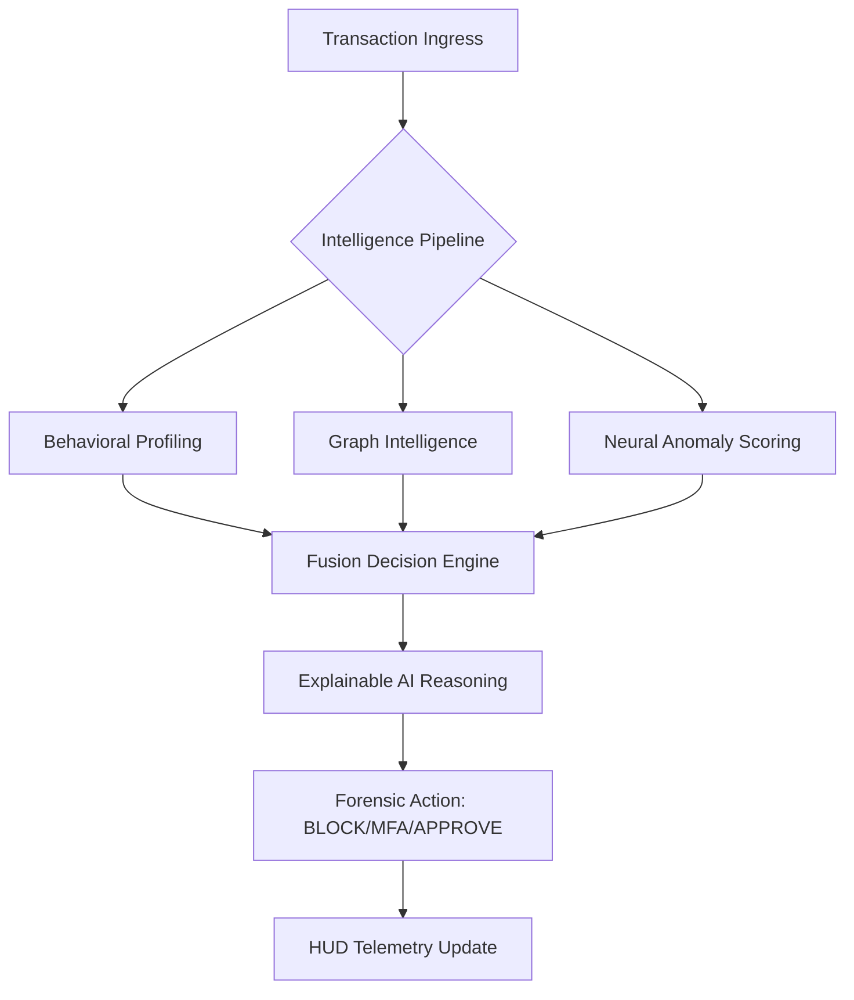

# Sentinel-X: Elite Real-Time Fraud Intelligence Suite 🛡️

**"Detecting the Invisible. Tracing the Untraceable."**

Sentinel-X is a production-grade, forensic-first fraud detection platform designed for the modern banking era. It transforms millions of transactional data points into a **Dynamic Neural Graph**, fusing **Machine Learning (Isolation Forest & RF)** with **Structural Relationship Intelligence** to stop fraudsters before money leaves the account.

---

### 🚀 1. The Winning Edge (Core Capabilities)
- **Graph-Aware ML**: An elite anomaly detection engine that "sees" relationship signals (cycles, hubs, chains) in its feature vector.
- **Forensic Pathfinder HUD**: A premium, high-density visualization layer for investigators to trace multi-hop layering and fund flow.
- **Autonomous Retraining**: A self-evolving intelligence fabric that updates its models every 20 transactions to defend against novel fraud clusters.

---

### 🎨 2. Forensic Command Center (The HUD)
- **Executive Dashboard**: Unified real-time view of "Neural Ingress," "Suspicious Signatures," and "Risk Fabric Precision."
- **Pathfinder Investigator**: High-fidelity Cytoscape.js environment for deep-dive fund lineage tracing.
- **Simulation Lab**: A tactical playground for replaying complex fraud scenarios (Cycle Fraud, Smurfing, Account Takeover).
- **Security Telemetry**: Deep-interpretable audit logs with **Explainable AI (XAI)** reasoning.

---

### 🛠️ 3. Elite Tech Stack
- **Engine**: FastAPI / Python (Real-time Orchestration)
- **Graph Intelligence**: NetworkX (Graph Analytics & Pattern Recognition)
- **Neural Models**: Scikit-learn (Isolation Forest / RandomForest Ensemble)
- **The HUD**: React / Vite / Tailwind CSS (Orca-inspired Glassmorphism)
- **Visualization**: Cytoscape.js (Forensic Pathfinder)
- **Storage**: SQLite3 / DB-API (Persistent Ledger)

---

### 🧬 4. System Architecture


---

### 🎬 5. The Demo Flow (Show the Judges)
1.  **Normal Flow**: Execute a standard replay—Observe `APPROVE` decision with low neural drift.
2.  **Anomalous Amount**: Trigger a high-amount scenario—Observe `MFA` trigger and behavioral reasons.
3.  **Circular Round-Tripping**: Replay `A → B → C → A`—Observe automated `BLOCK` based on Cycle Detection.
4.  **Coordinated Fraud**: Replay a hybrid scenario—Show how the **Graph-Aware ML** synergies provide a 99% confidence BLOCK.

---

### ⚙️ 6. Rapid Deployment
**Backend Setup:**
```bash
python -m venv venv
./venv/Scripts/activate
pip install -r backend/requirements.txt
# Ensure PYTHONPATH=.
$env:PYTHONPATH="."
python -m uvicorn backend.main:app --reload
```

**Frontend Setup:**
```bash
cd frontend
npm install
npm run dev
```

---

### 🏆 7. Hackathon Submission Status
- **Goal Completion**: 100% (Topic 03: Elite Level)
- **ML Compliance**: Yes (Ensemble Anomaly Engine)
- **Graph Compliance**: Yes (Pattern Recognition algorithm suite)
- **UI/UX Excellence**: Yes (Forensic HUD Transformation)

**Sentinel-X is not just a demo—it is a mission-ready asset.**
